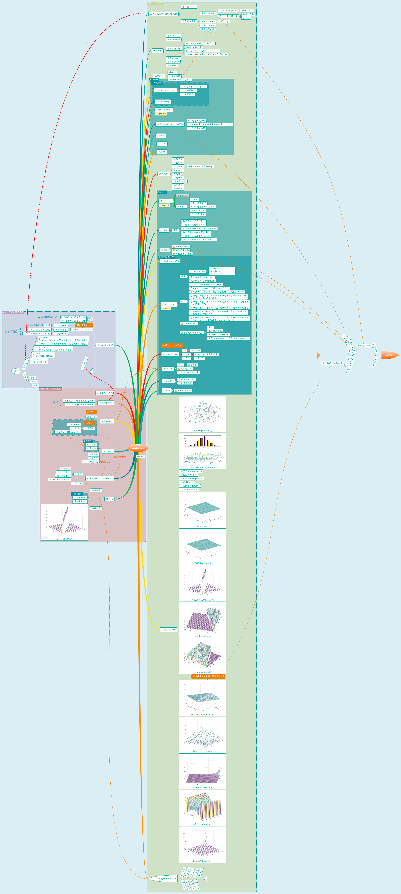
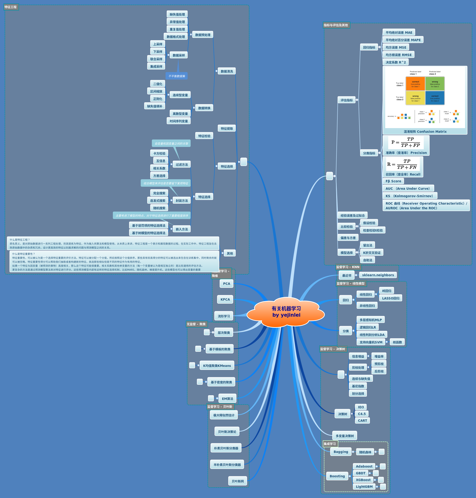

# about-ml 有关机器学习

----------

## 一、数学基础

数学知识点汇总

微积分

线性代数

概率论和统计学

- 统计数据的展示

	

- 概率与统计思维导图

    

- 基本概率分布

    

最优化

## 二、Python/R/Octave语言

Python语言

- [Python学习笔记](http://nbviewer.jupyter.org/github/yejinlei/about-python)
- Ananconda[配置](./tools/.condarc)及pip[配置](./tools/pip.ini)
- [Scikit-learn 0.21.x 中文文档](http://sklearn.apachecn.org)

R语言

Octave

- [octave online](https://octave-online.net/)

## 机器学习分类

有监督学习

无监督学习

强化学习

 

深度学习

迁移学习

元学习

## 机器学习领域

图像处理领域

自然语言领域

语音识别领域

## 统计学习和机器学习

机器学习算法关系图

机器学习思维导图

## 深度学习

深度学习知识点汇总

深度学习中的优化算法

## AutoML/AutoDL

> AutoML as a CASH Problem
>>  **C**ombined **A**lgorithm **S**election and **H**yperparameter optimization

- 自动特征工程
- 自动模型选择
- 自动超参数优化
- 开源项目 
  - 

AutoML/AutoDL流程图

    

    

  库、框架|核心组件及函数|使用与评估
  ---|---|---
  [automl_gs](https://github.com/minimaxir/automl-gs)|[**automl_grid_search**网格搜索策略](https://github.com/minimaxir/automl-gs/automl_gs/blob/master/automl_gs.py): step1:**get_problem_config**，从[评估指标模板](https://github.com/minimaxir/automl-gs/blob/master/automl_gs/metrics.yml)中获取学习类型及指标； step2:**build_hp_grid函数**，使用[超参数模板](https://github.com/minimaxir/automl-gs/blob/master/automl_gs/hyperparameters.yml)构建所有**超参数**； step3:**render_model函数**，在script目录下的[model模型模板](https://github.com/minimaxir/automl-gs/blob/master/automl_gs/templates/scripts/model)和[pipeline函数模板](https://github.com/minimaxir/automl-gs/blob/master/automl_gs/templates/scripts/pipeline)中填入超参数，生成可执行的脚本； step4:**train_generated_model函数**，训练模型； step5:显示结果|
  [auto-sklearn](https://github.com/automl/auto-sklearn)、[文档](https://automl.github.io/auto-sklearn/master/)||
  [h2o-3](https://github.com/h2oai/h2o-3)、[文档](http://docs.h2o.ai/h2o/latest-stable/h2o-docs/index.html)|

h2o on spark

 |

## 参考资料
  
- 文档
1. [scikit-learn (sklearn) 官方文档中文版](https://sklearn.apachecn.org/)
2. [H2O.ai文档](http://docs.h2o.ai/h2o/latest-stable/h2o-docs/index.html)
- 论文
  - 元学习
    - [floodsung/Meta-Learning-Papers](https://github.com/floodsung/Meta-Learning-Papers)

- 文章
1. [An Overview of AutoML Libraries Used in Industry](https://www.shangyexinzhi.com/article/313707.html)
2. [自动机器学习：最近进展研究综述](https://www.leiphone.com/news/201908/cM4vkvgmXinZ1Cky.htmlhttps://baijiahao.baidu.com/s?id=1641540911794101828&wfr=spider&for=pc)
3. [机器学习平台建设](https://blog.csdn.net/SoftwareTeacher/article/details/82692184)