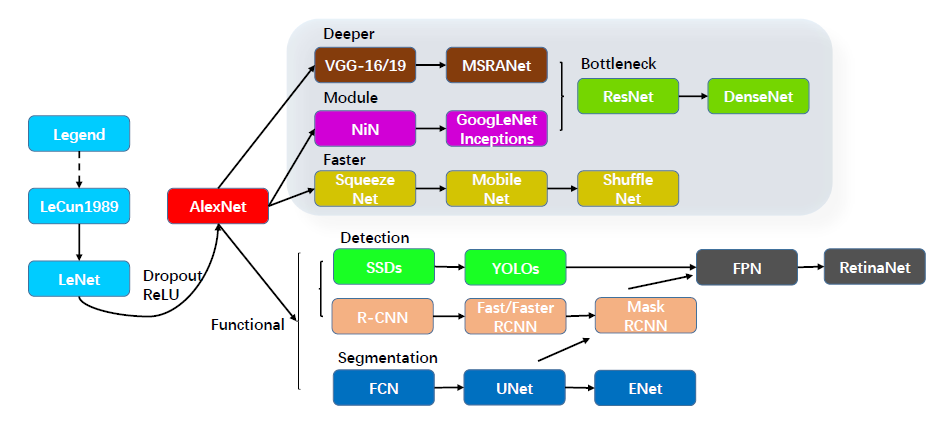
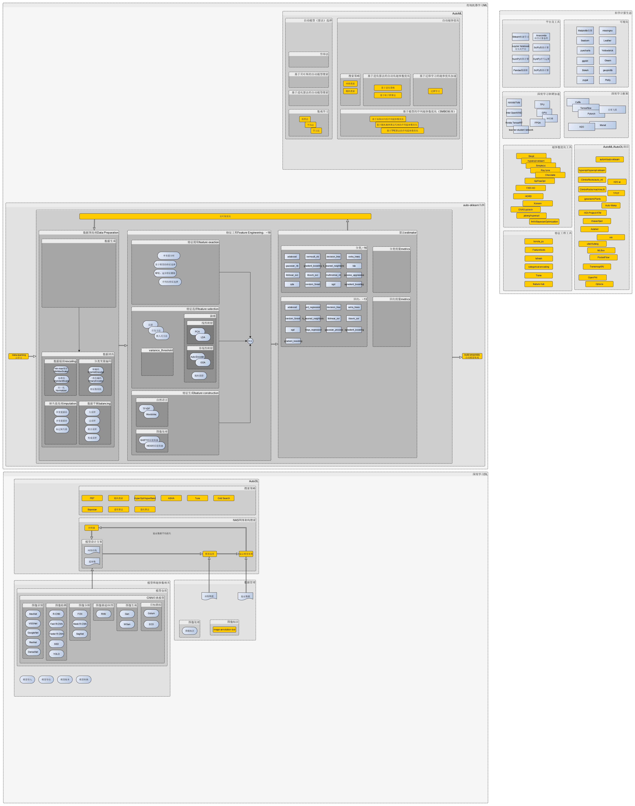

# about-ml 有关机器学习[【github】](https://github.com/yejinlei/about-ml)[【gitee】](https://gitee.com/yejinlei-co/about-ml)

----------

## 一、数学基础

数学知识点汇总

微积分

线性代数

概率论和统计学

- 统计数据的展示

	

- 概率与统计思维导图

    

- 基本概率分布

     [Univariate Distribution Relationships](http://www.math.wm.edu/~leemis/chart/UDR/UDR.html)

最优化

## 机器学习分类

有监督学习

无监督学习

强化学习

 

深度学习

迁移学习

元学习

## 面向领域

图像处理领域

自然语言领域

语音识别领域

## 机器学习ML

机器学习算法关系图

机器学习思维导图

## 深度学习DL

深度学习知识点汇总

深度网络模型发展方向

Deeper：网络层数更深，代表网络VggNet
Module：采用模块化的网络结构（Inception），代表网络GoogleNet
Faster：轻量级网络模型，适合于移动端设备，代表网络MobileNet和ShuffleNet
Functional：功能型网络，针对特定使用场景而发展出来。如检测模型YOLO，Faster RCNN；分割模型FCN，UNet

深度学习中的优化算法

## 自动化学习AutoML/AutoDL

1. > **AutoML as a CASH Problem**
   >> **C**ombined **A**lgorithm **S**election and **H**yperparameter optimization

 

AutoML/AutoDL概览

     
    
     

 

2. **自动机器学习流程**
   
   1. 自动数据清洗
   2. 自动特征工程
   3. 自动数据建模
      1. 自动算法选择
      2. 自动超参数优化
         - 网格搜索(Gird Search)
         - 随机搜索(Random Search)
         - 贝叶斯优化(Bayesian Optimization)
   4. 自动模型评估
      1. 模型度量
   2. 模型解释
   
3. **自动深度学习流程**
   
    1. 数据自动增强
    2. 网络模型自动优化
        - 超参数自动搜索
        - 网络结构搜索（NAS，基于强化学习、进化算法、可微分架构）
          - 归一化自动学习和配置
          - 激活函数自动学习和配置
          - 损失函数自动学习和配置
        - 网络模型自动剪枝
        - 网络模型自动压缩/蒸馏
3. 网络模型量化
   
4. **开源库评估**

  简介|库、框架|核心组件及函数|使用与评估
  ---|---|---|---
  _|hyperparameter_hunter [github](https://github.com/HunterMcGushion/hyperparameter_hunter/tree/v3.0.0)||
  _|automl_gs [github](https://github.com/minimaxir/automl-gs)、[tutorial](https://github.com/minimaxir/automl-gs/blob/master/docs/automl_gs_tutorial.ipynb)、[exampes](https://github.com/minimaxir/automl-gs-examples)|[**automl_grid_search**网格搜索策略](https://github.com/minimaxir/automl-gs/automl_gs/blob/master/automl_gs.py): step1:**get_problem_config**，从[评估指标模板](https://github.com/minimaxir/automl-gs/blob/master/automl_gs/metrics.yml)中获取学习类型及指标； step2:**build_hp_grid函数**，使用[超参数模板](https://github.com/minimaxir/automl-gs/blob/master/automl_gs/hyperparameters.yml)构建所有**超参数**； step3:**render_model函数**，在script目录下的[model模型模板](https://github.com/minimaxir/automl-gs/blob/master/automl_gs/templates/scripts/model)和[pipeline函数模板](https://github.com/minimaxir/automl-gs/blob/master/automl_gs/templates/scripts/pipeline)中填入超参数，生成可执行的脚本； step4:**train_generated_model函数**，训练模型； step5:显示结果|
   _ |auto-sklearn [github](https://github.com/automl/auto-sklearn)、[doc](https://automl.github.io/auto-sklearn/master/)||
  _ |h2o-3 [github](https://github.com/h2oai/h2o-3)、[doc](http://docs.h2o.ai/h2o/latest-stable/h2o-docs/index.html)|

h2o on spark

 |
  _ | autokeras [github](https://github.com/keras-team/autokeras)
  _ | Auto-PyTorch [github](https://github.com/automl/Auto-PyTorch)
  _ | nni [github](https://github.com/Microsoft/nni.git)、[doc](https://github.com/microsoft/nni/blob/master/README_zh_CN.md)

## 参考资料

- 文档
  - 
  - [scikit-learn (sklearn) 官方文档中文版](https://sklearn.apachecn.org/)
  - [H2O.ai文档](http://docs.h2o.ai/h2o/latest-stable/h2o-docs/index.html)

- 论文
  - 元学习
    - [floodsung/Meta-Learning-Papers](https://github.com/floodsung/Meta-Learning-Papers)

- 文章
  - [An Overview of AutoML Libraries Used in Industry](https://www.shangyexinzhi.com/article/313707.html)
  - [自动机器学习：最近进展研究综述](https://www.leiphone.com/news/201908/cM4vkvgmXinZ1Cky.htmlhttps://baijiahao.baidu.com/s?id=1641540911794101828&wfr=spider&for=pc)
  - [机器学习平台建设](https://blog.csdn.net/SoftwareTeacher/article/details/82692184)
  - [使用 Hyperopt 进行参数调优（译）](https://www.jianshu.com/p/35eed1567463)
  - [如何学习AutoML在模型优化中的应用](https://zhuanlan.zhihu.com/p/150455253)
  - [归一化激活层的进化：谷歌Quoc Le等人利用AutoML 技术发现新型ML模块](https://www.cnblogs.com/cx2016/p/12955409.html)
  - [论文解读: Auto HAS - 结合超参数搜索和NAS](https://zhuanlan.zhihu.com/p/149888426?from_voters_page=true)